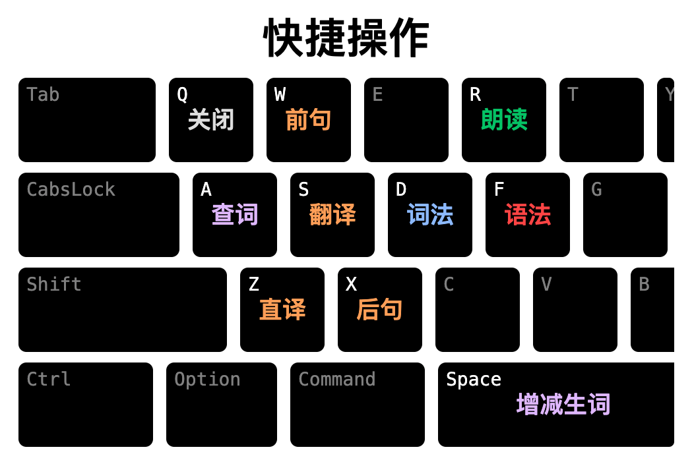
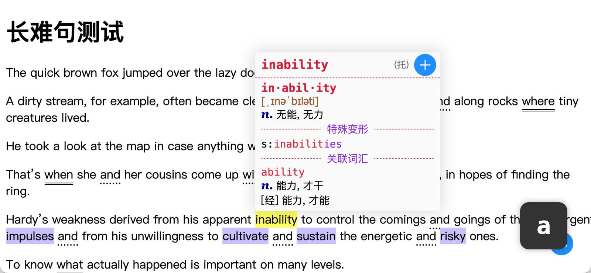
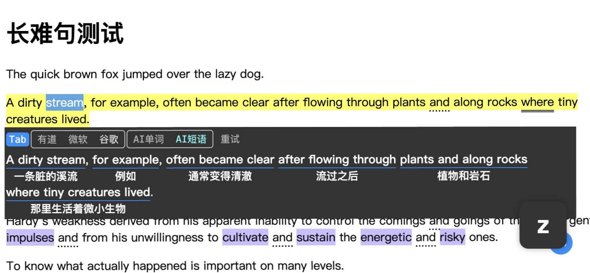
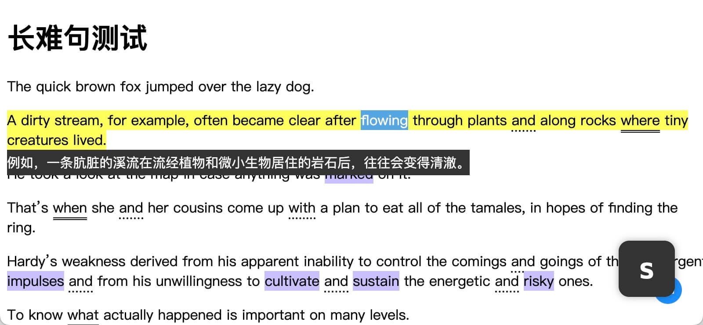
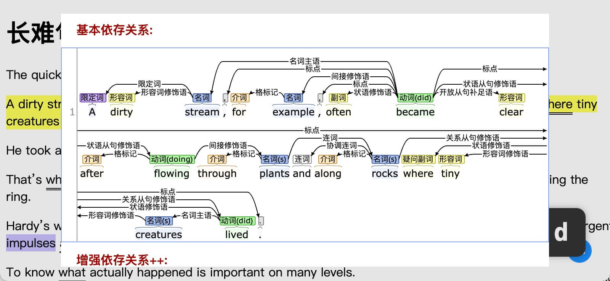
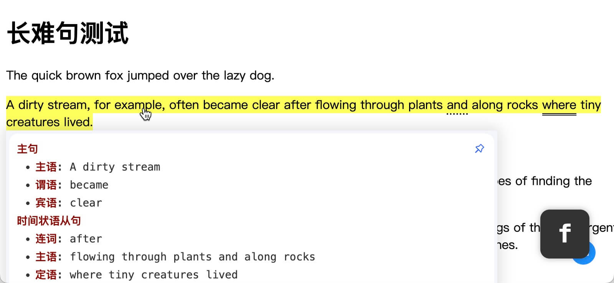

【英语学习革命！】这款智能浏览器插件，让你的词汇量飙升，阅读无障碍！

🔥【智能高亮】：精准定位你的知识盲区，让生词无所遁形！
📚【词库管理大师】：打造专属词汇宝典，学习进度一手掌握！
🎯【语境记忆法】：情境中学习，单词用法一目了然！
🌐【即时翻译神器】：无缝切换，阅读流畅无阻！
🎧【发音朗读】：视听结合，记忆效率翻倍！
📊【词法依赖分析】：洞悉句子骨架，语法难题迎刃而解！
💡【语法专家解读】：深度解析，长难句不再是梦魇！
🚀 立即体验，开启你的英语学习新纪元！

# 掌握英语，畅游网络的新利器

欢迎体验革新升级的浏览器插件，一款专为英语学习者打造的智能工具，让您的英语学习变得更加高效、有趣。

## 核心功能

### 一：智能高亮

- 根据您的初始单词等级（小学、初中、高中、四六级、考研、托福等），自动高亮网页中超过您当前水平的单词。您可以轻松识别需要重点学习的生词。

### 二：词库管理

- 在浏览网页时，可以标记并管理生词，插件帮您逐渐完善个性化词库。这样，您不仅能够清晰记录学习进度，还能针对性地复习和巩固自己的词汇。

### 三：生词语境

- 生词会自动附带所在语句，形成语境记忆。这种语境学习方法不仅有助于理解单词的用法，还能增强记忆效果，使学习更加高效。

### 四：语句翻译

- 插件内置即时语言翻译功能，帮助您快速理解整句意思，无需切换页面，提升阅读流畅度。

### 五：发音朗读

- 插件提供单词发音和整句朗读功能，通过听觉和视觉的结合，增强记忆效果，使学习过程更加生动。

### 六：词法依赖

- 插件能够精确分析句中每个单词的词性和词汇之间的依存关系。便于深入理解句子结构，提升语言解析能力。

### 七：语法分析

- 通过大模型进行语法分析，提供详细的语法解析，各种长难句轻松解决，让您的阅读更上一层楼。

### 不容错过的亮点

- **无缝集成的体验**： 操作简便，无需离开当前页面，即可轻松进行阅读。高效精准的操作让您专注学习，减轻额外的交互和心智负担。

- **多维度学习提升**： 结合个人词库、生词语境、词性分析、依存关系、语法解析和发音朗读，全方位提升您的英语能力。

立即下载我们的浏览器插件，探索英语学习的全新境界！让每一次浏览都成为您英语进步的宝贵时刻。开启您的英语学习新篇章，掌握语言的力量！

## 操作交互

### 快捷键（默认）

- <kbd>Alt</kbd> + <kbd>U</kbd> 启用插件。
- <kbd>A</kbd> 键：查询单词；<kbd>S</kbd> 键：翻译整句；<kbd>D</kbd> 键：词汇依赖；<kbd>F</kbd> 键：语法分析。

### 查词 & 高亮生词

### AI 翻译（按词、短语）

### 机器翻译

### NLP 词法依赖

### AI 语法分析

