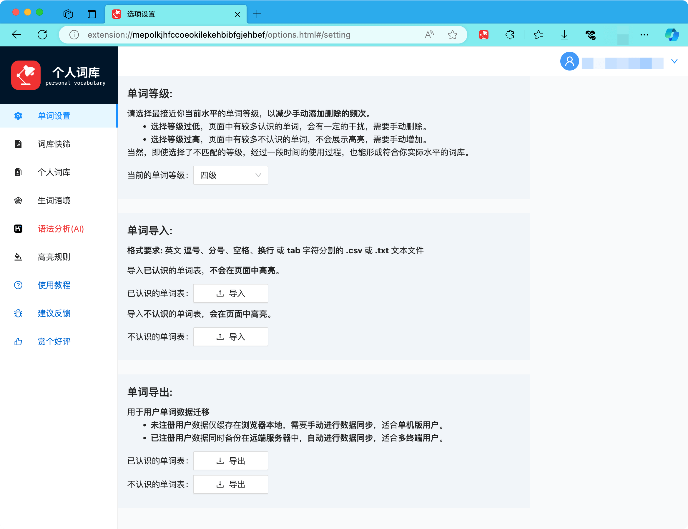
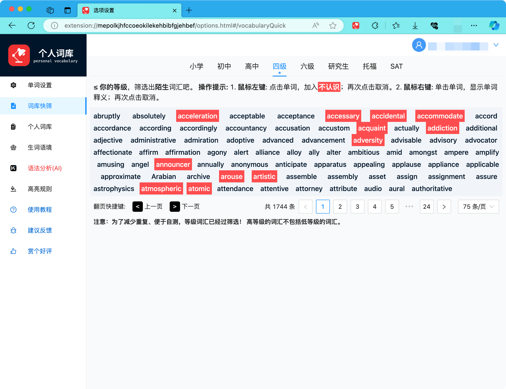
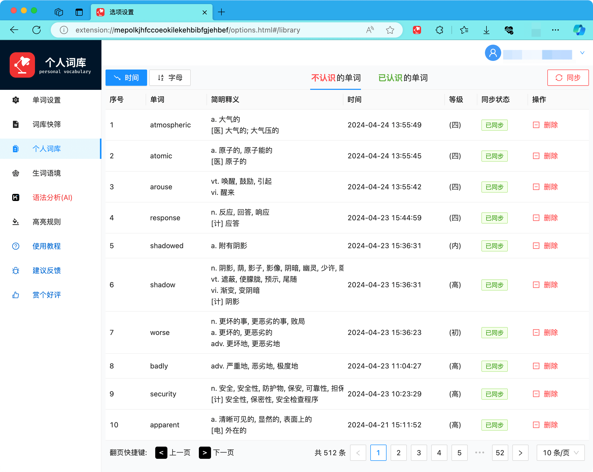
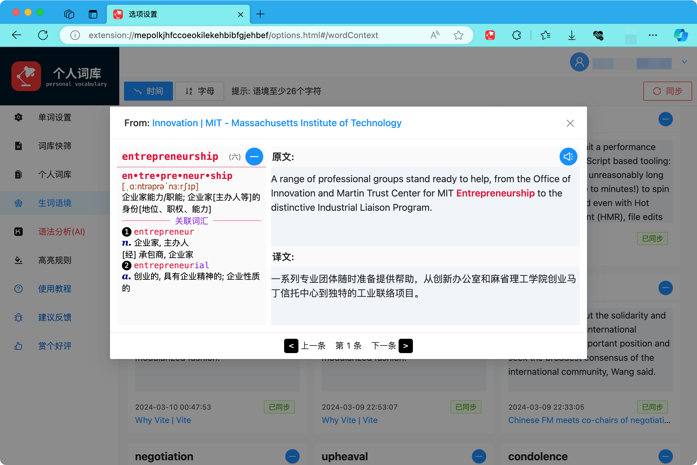

# 词库管理

## 1. 单词设置

- 选择等级： 选择最接近个人水平的等级
- 词库导入、导出

{data-zoomable}

<!--
## b. 等级词库

**词库等级按照考试等级的词汇量数量进行分级。**

**注意各等级词汇已经过筛选！** 高等级的词汇不包括任何低等级的词汇，减少重复，便于用户自测。

可以在等级词汇表格里，**查看单词释义**，并**增加生词**（不认识的单词），**增加熟词**（已认识的单词）。

{data-zoomable}
-->

## 2. 词库快筛

通过直接粗暴的方式进行快速筛选，一步到位建立个人词库 😄

**注意：各等级词汇已经过筛选！** 高等级的词汇不包括低等级的词汇，减少重复，便于自测。

<!-- 是等级词库的筛选方式的**另一种快捷实现**。简单快速，适用于想尽快完善个人词库的急性子同学。 -->

| 鼠标点击        | ≤ 当前等级     | > 当前等级     |
| :-------------- | :------------- | :------------- |
| <kbd>左键</kbd> | 表示**不认识** | 表示**已认识** |
| <kbd>右键</kbd> | 查询单词释义   | 查询单词释义   |

{data-zoomable}

## 3. 个人词库

- 展示<b>等级内「不认识」的单词</b>

{data-zoomable}

## 4. 生词语境

以下情况下：

- 单词未高亮，后加入高亮时
- 单词已高亮，查看释义后，未取消高亮时
- 单词所在语句长度 >26 个字符时

会将生词及所在的语句，同时加入生词语境

{data-zoomable}

## 5. 语法分析(AI)

- 提供：**免费**大模型、**本地**(Ollama)大模型、**Kimi** 大模型、**阿里千问**大模型

.png>){data-zoomable}

## 6. 高亮规则

<HighlightRule />

