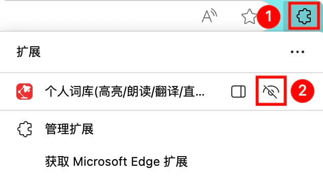
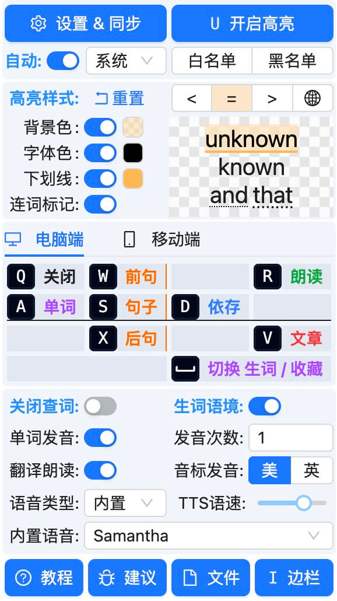
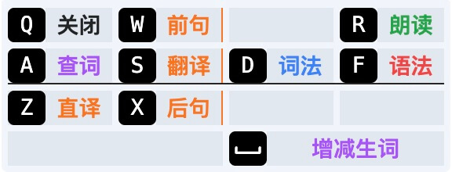

# 插件设置

## 1. 置顶插件

  
  <ul>
    <li>点击<b>扩展图标</b>（类似拼图形状）</li>
    <li>在展开列表中，点击<b>置顶操作</b></li>
  </ul>

## 2. 功能介绍

<!--
- **高亮**：
  - **颜色**：由于存在浅色和深色等主题，建议选择**中性灰色**。
  - **样式**：为尽量不改动原文样式，且不让高亮显得特别突兀，样式只支持 **三选一**。
  - **策略**：**动态策略**实时高亮网页中视野范围内的单词；**全文策略**高亮网页内所有单词。
- **快捷键**：采用 空格 ASDF 作为快捷键，因为左手放在键盘上更方便。其中 F 键可以连按，减少记忆负担
  - **空格**：当出现单词释义时，空格键可快速**增加生词**、**删除生词**。
  - **A/F\*1**: **查单词**。在单词上按 **A 键**或 **F 键**。
  - **S/F\*2**: **翻译短句**，通常指逗号分隔的短句。在单词上按 **S 键** 或 **FF 键**。
  - **D/F\*3**: **翻译整句**。在单词上按 **D 键** 或 **FFF 键**。
- **文本翻译引擎**：对整句进行翻译，选择**有道、谷歌**翻译引擎
- **自动发音**：对单词、整句，是否继续自动发音，**视觉、听觉组合加强记忆**
- **发音次数**：在自动发音的前提下，**连续播放**几次，可以设置 1-3 次，默认 1 次
- **单词长度**：至少几个字符认定为**有效单词**。用来**减少无效词汇或缩略语干扰**，默认为 4

{data-zoomable}
-->

  <ul>
    <li><b>开启高亮</b>: 高亮当前网页中的生词，默认快捷键 <kbd>Alt</kbd>+<kbd>U</kbd>。</li>
    <li><b>设置&同步</b>: 打开<a href="#三-词库管理">词库管理页面</a>。</li>
    <li><b>自动高亮</b>: 如当前网站为英文网站，自动开启高亮。</li>
    <li><b>黑名单</b>: 当前网站禁止启用插件； <b>白名单</b>: 当前网站始终启用插件。</li>
    <li><b>高亮设置</b>:
      <ul>
        <li>
          

            <b>样式</b>: <b class="bg-[#c8c0ff]">背景色</b>+<b class="text-blue-500">字体色</b>+<b class="border-black border-b-[1px]">下划线</b>组合设置。
            
区分<b>更高、更低等级</b>词汇，搭配<b>不同高亮颜色</b>。颜色区分的目的是：

            <ul style="margin: 0">
              <li style="margin: 0"><b>< (低)</b> 等级的生词， <b>应该务必掌握</b>；</li>
              <li style="margin: 0"><b>> (高)</b> 等级的生词， <b>可以暂时不用掌握</b>。</li>
            </ul>
            
          

          
<i>注意</i>: 通过插件打开PDF时，仅支持<b class="bg-[#c8c0ff]">背景色</b>+<b class="border-black border-b-[1px]">下划线</b>组合设置。<b class="text-blue-500">字体色</b>对渲染有冲突。

        </li>
        <li>
          <b>策略</b>:
          <ul>
            <li><b>全文策略</b> 高亮网页内所有单词；</li>
            <li><b>动态策略</b> 高亮视野范围内的单词。</li>
          </ul>
        </li>
      </ul>
    </li>
    <li>
      
<b>快捷操作</b>:

      <ul>
        <li>
          <b>电脑端</b>: 采用 <kbd>Space</kbd> <kbd>A</kbd> <kbd>S</kbd> <kbd>D</kbd> <kbd>F</kbd> <kbd>Q</kbd> 作为主要快捷键
          
          <ul>
            <li>主要快捷键:
              <ul>
                <li><b>A 键</b>: <b>查询单词</b>。在单词上按 <kbd>A</kbd> 键</li>
                <li><b>空格</b>: <b>增减生词</b>。出现单词释义时，按<kbd>Space</kbd>键</li>
                <li><b>S 键</b>: <b>机译整句</b>。在单词所在句子上按 <kbd>S</kbd> 键</li>
                <li><b>D 键</b>: <b>词法依赖</b>。在单词所在句子上按 <kbd>D</kbd> 键</li>
                <li><b>F 键</b>: <b>语法分析</b>。在单词所在句子上按 <kbd>F</kbd> 键</li>
              </ul>
            </li>
            <li>次要快捷键:
              <ul>
                <li><b>Z 键</b>: <b>直译整句</b>。在单词所在句子上按 <kbd>Z</kbd> 键</li>
                <li><b>W 键</b>: <b>翻译上句</b>。在单词所在句子上按 <kbd>W</kbd> 键</li>
                <li><b>X 键</b>: <b>翻译下句</b>。在单词所在句子上按 <kbd>X</kbd> 键</li>
              </ul>
            </li>
          </ul>
        </li>
        <li>
          <b>移动端</b>: 采用 <kbd>点</kbd> <kbd>右</kbd> <kbd>左</kbd> <kbd>选</kbd> 作为快捷操作
          
          <ul>
            <li><b>点</b>: <b>查词</b>。点击单词，查看释义</li>
            <li><b>右</b>: <b>翻译</b>。向右滑动单词，翻译整句</li>
            <li><b>左</b>: <b>语法</b>。向左滑动单词，分析语法</li>
            <li><b>选</b>: <b>兜底</b>。选择文本后，自由选择查词、翻译、语法</li>
          </ul>
        </li>
      </ul>
    </li>
    <li><b>自动发音</b>：对单词、整句，自动发音，<b>视听结合</b>强化记忆。</li>
    <li><b>发音次数</b>：自动发音时，<b>连续朗读</b>多次，默认 1 次。</li>
    <li>
      <b>语音类型</b>：<b>TTS</b>(文本转语音)、<b>有道</b>在线语音
      <ul>
        <li>使用TTS时，可<b>选择人声</b>、<b>调整语速</b>。大部分支持朗读<b>实时标记</b>单词</li>
        <li>TTS语音包括<b>离线</b>和<b>在线</b>。离线速度快，在线质量佳</li>
      </ul>
    </li>
    <li><b>生词语境</b>：在<b>查看生词</b>、<b>新增生词</b>时，<b>自动加入</b>所在句子作为生词的语境</li>
  </ul>

