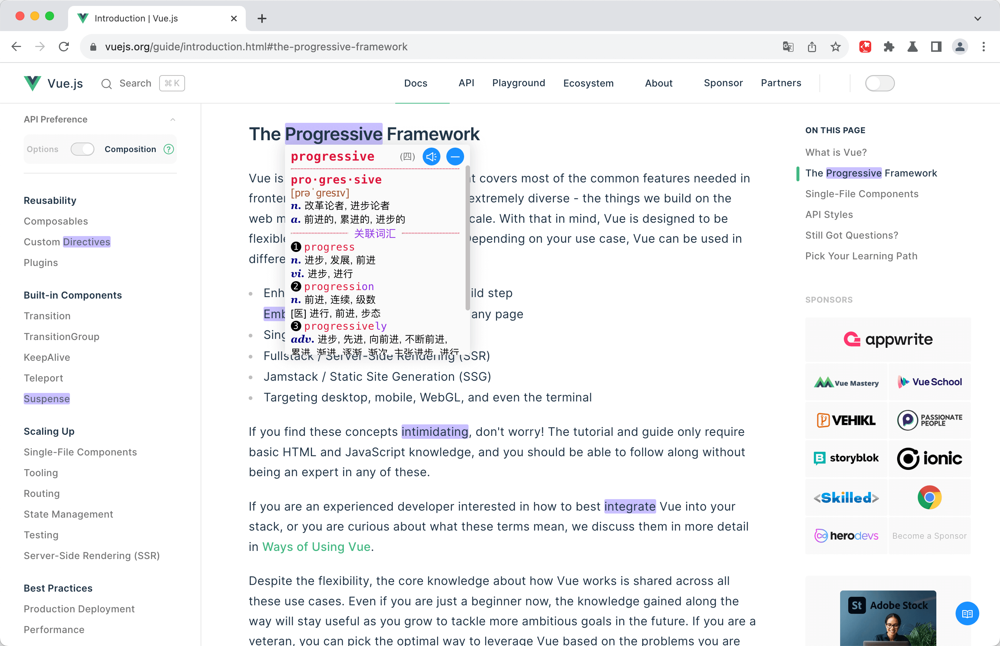
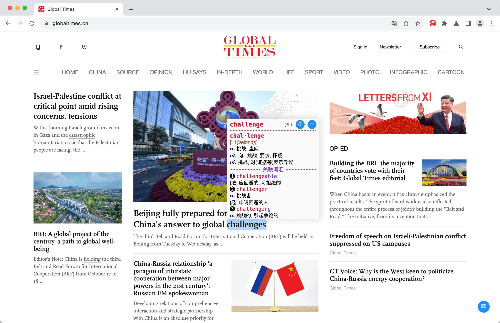
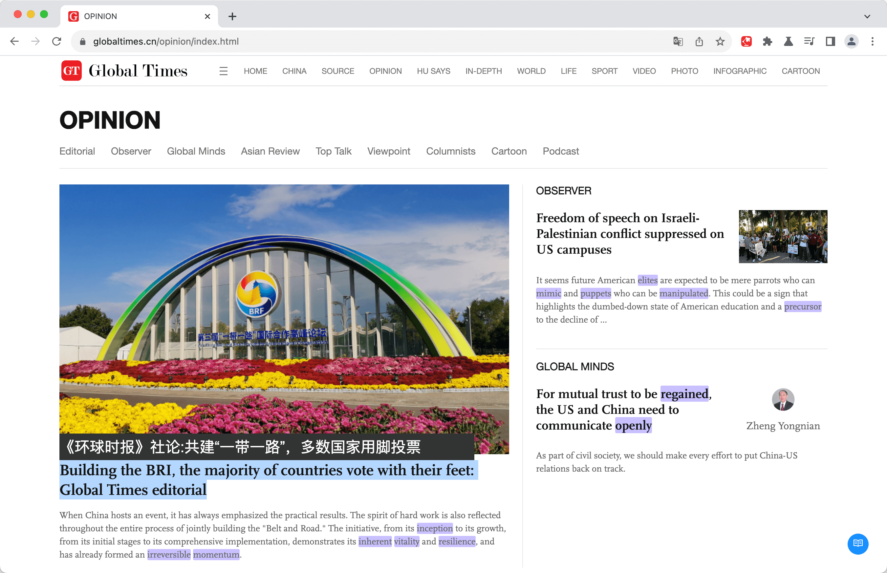
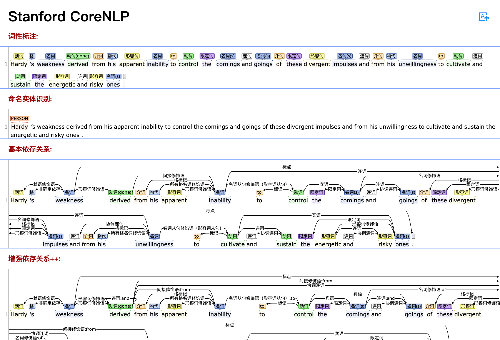
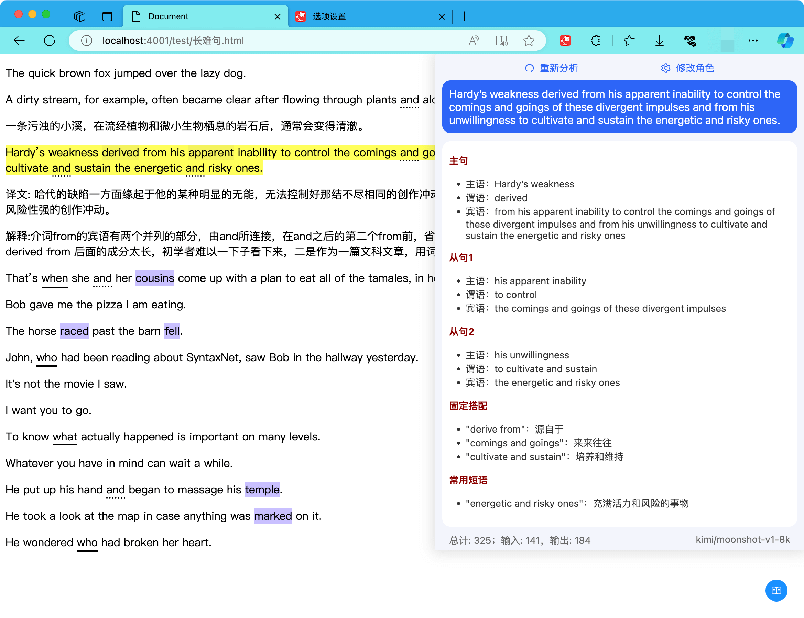
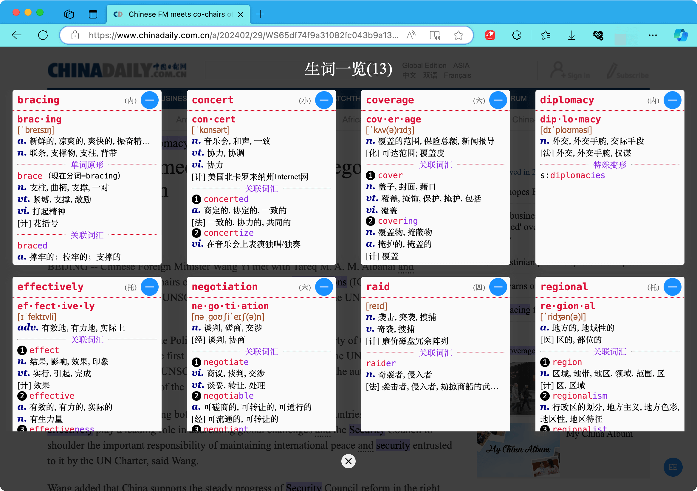

# 阅读展示

以 [Vue 开发文档](https://vuejs.org/) 和 [环球时报](https://www.globaltimes.cn/) 为例：(或其他技术类、新闻类英文网站)

## 1. 高亮生词

- 鼠标悬浮在高亮词汇时，展示释义
- <kbd>Space</kbd> 键: 删除生词，取消高亮

> 高亮样式(背景)

{data-zoomable}

## 2. 查询单词

- 直接查询：在**鼠标所指单词**上，按<kbd>A</kbd> 键
- 选择查询：先<b class="bg-[#1890ff] text-white">选择</b>单词，再按 <kbd>A</kbd> 键
- <kbd>Space</kbd> 键:
  - **加入生词**，同时高亮
  - **删除生词**，取消高亮

> 高亮样式(下划线)

{data-zoomable}

## 3. 翻译整句

- 直接翻译：在**鼠标所指单词**上，按<kbd>S</kbd> 键
- 选择翻译：先<b class="bg-[#1890ff] text-white">选择</b>句子，再按 <kbd>S</kbd> 键

{data-zoomable}

## 4. 词法依赖

- 直接分析：在**鼠标所指单词**上，按<kbd>D</kbd> 键
- 选择分析：先<b class="bg-[#1890ff] text-white">选择</b>句子，再按 <kbd>D</kbd> 键

{data-zoomable}

## 5. 语法分析

- 直接分析：在**鼠标所指单词**上，按<kbd>F</kbd> 键
- 选择分析：先<b class="bg-[#1890ff] text-white">选择</b>句子，再按 <kbd>F</kbd> 键

{data-zoomable}

## 6. 生词一览

- 展示文章中出现的所有生词
- 可以预习、复习、删除生词

{data-zoomable}
