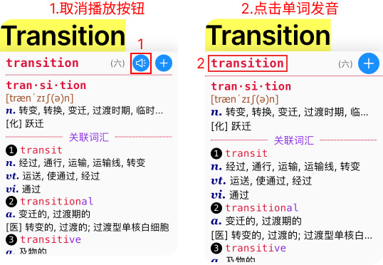
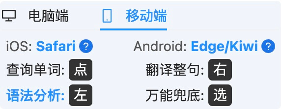
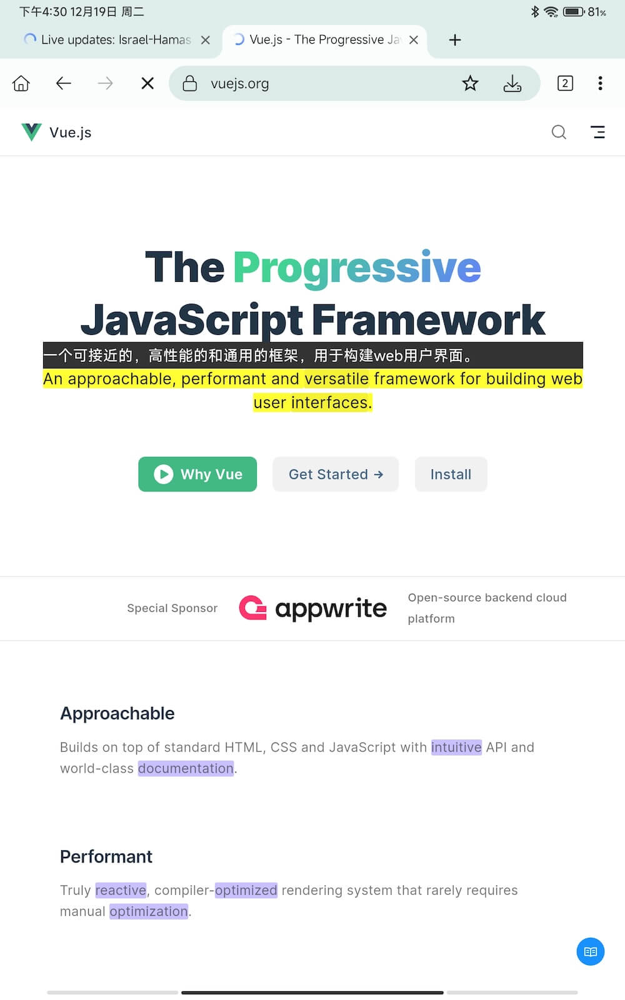

# v0.3

## 0.3.16

- 增加 **自动、亮色、暗色主题切换**（方便夜间阅读和黑色页面阅读）
- **增加 iframe 支持**（网页内嵌套网页，如：在邮箱内打开英文邮件）
- **支持 iOS 端的 Safari**（适用 iPhone、iPad），请前往 App Store 下载安装
- 修复**安卓 Kiwi** 打开插件设置页，关闭设置页时不能回到此前此页面的问题
- UI 功能调整：在单词释义面板中，**删除发音按钮**，改为**点击单词发音**。

  

  因为，移动端屏幕较小，按钮要求精确点击，多了额外的心智负担；面板中其他单词也是点击发音，更为统一。

## 0.3.15.3

- 完善 pdf 连词下划线：<b style="border-bottom: 2px dotted black;">并列连词</b>、<b style="border-bottom: 3px double black;">从句连词</b>
- 移动端点击文字限制英文 <!-- (TODO: 再验证) -->
- popup 页优先展示当前平台操作提示
- 高亮背景色优化：解决 background-clip 与高亮背景色冲突

## 0.3.15.2

- **TTS** 选择时 增加**推荐标签**、优化**选择顺序**
- **高亮样式**增加支持<b style="background-color: #c8c0ff66;">背景色</b>、<b style="color: #0000ff66;">字体色</b>、<b style="border-bottom: 1px solid #ff000033;">下划线</b>透明度
- PDF 高亮颜色调整：通过插件打开 PDF 时，仅支持<b style="background-color: #c8c0ff;">背景色</b>+<b style="border-bottom: 1px solid black;">下划线</b>组合设置，<b style="color: blue;">字体色</b>对渲染 PDF 有冲突。
- 弥补非母语的语感不足，突出显示连接词，区分<b style="border-bottom: 2px dotted black;">并列连词</b>（and, or 等）和<b style="border-bottom: 3px double black;">从句连词</b>（that, which 等）
- Safari 移动端 UI 优化

## 0.3.15

- 突出显示连接词（增加视觉辅助效果，弥补非母语的语感不足）
- 完善移动端交互，更自然地滑动选择整句
- 优化移动端管理页面（功能有取舍，增加横屏竖屏显示内容区分）
- 解决插件样式冲突
- PDF 中的连字(Ligature)解析(初步完成)
- 增加适配 Safari(iOS/Mac)，开发中

## 0.3.14

- 增加<b>移动端适配</b>: 采用 <kbd>点</kbd> <kbd>滑</kbd> <kbd>选</kbd> 作为快捷操作，<b>只需单手就能满足交互</b>

<table>
  <tr>
    <td style="width:300px;">
      
      <ul>
        <li><kbd>点</kbd>: 点击单词，查看释义。</li>
        <li><kbd>滑</kbd>: 滑动两个单词，翻译所在整句。</li>
        <li><kbd>选</kbd>: 查询或翻译已选择内容。</li>
      </ul>
    </td>
    <td>
      
    </td>
  </tr>
</table>

- <b>定制选区高亮</b>，区分浏览器默认的选择高亮
  
- <b>增加 2 种自动高亮规则</b>：
  
  - 网址中包含 en-us (英文)的网站
  - 本插件使用阅读 PDF 文件的网址（来自火狐 GitHub）
- Popup 选项，之前只支持一种高亮方式。
  
  
由于存在浅色和深色等主题，现在支持<b style="background-color: #c8c0ff;">背景色</b>+<b style="color: blue;">字体色</b>+<b style="border-bottom: 1px solid black;">下划线</b>组合设置。

  
<b>注意</b>: 通过本插件打开PDF时，将只开启<b style="background-color: #c8c0ff;">背景高亮</b>。其他颜色对渲染有一定的冲突。

- 选项设置页，增加主页和使用教程跳转
- 完善 PDF 文本断句

## 0.3.13

- **插件设置**页面：新增**自动高亮规则**

  <HighlightRule />

## 0.3.12.2

- 完善 TTS 语音，优化**朗读标记**功能
- 优化 popup 页面白屏体验
- 优化 F 键自由选择
- 修复有道翻译换行 bug
- 插件升级时，自动跳转更新日志

## 0.3.12

- 优化 TTS 语音，支持动态高亮朗读的句子中的单词（Edge 在线 TTS 功能尤为优秀）
- 增加翻译缓存，优化翻译响应

## 0.3.11

- 修复服务回收后，数据丢失，需要重新刷新才能显示的 bug
- 「设置与数据同步」
  - 「个人词库」增加点击单词播放读音

## 0.3.10

- 增加离线后自动登录功能
- 增加音标类型（美式音标、英式音标）切换
- 「设置与数据同步」
  - 「词库快筛」查询单词释义，精简展示内容、优化滚动位置
  - 「个人词库」增加词库范围提示

## 0.3.9

- 增加网络查询单词关联：原形、比较级、最高级

## 0.3.8

- **认识或不认识所有简单变形的单词**
- 优化单词释义展示的大小写变形

## 0.3.7

- Popup 中 按钮「设置与数据同步」始终显示

## 0.3.6

- **增加单词关系，单词变形、单词原形、关联单词**

