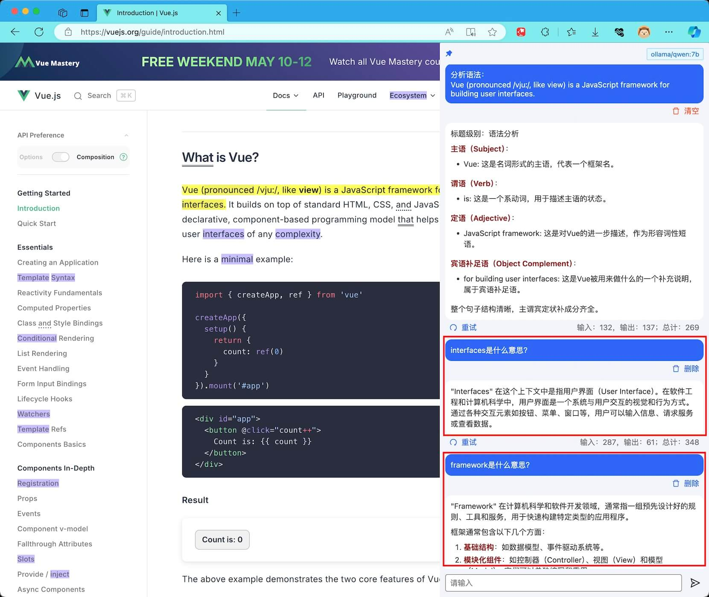
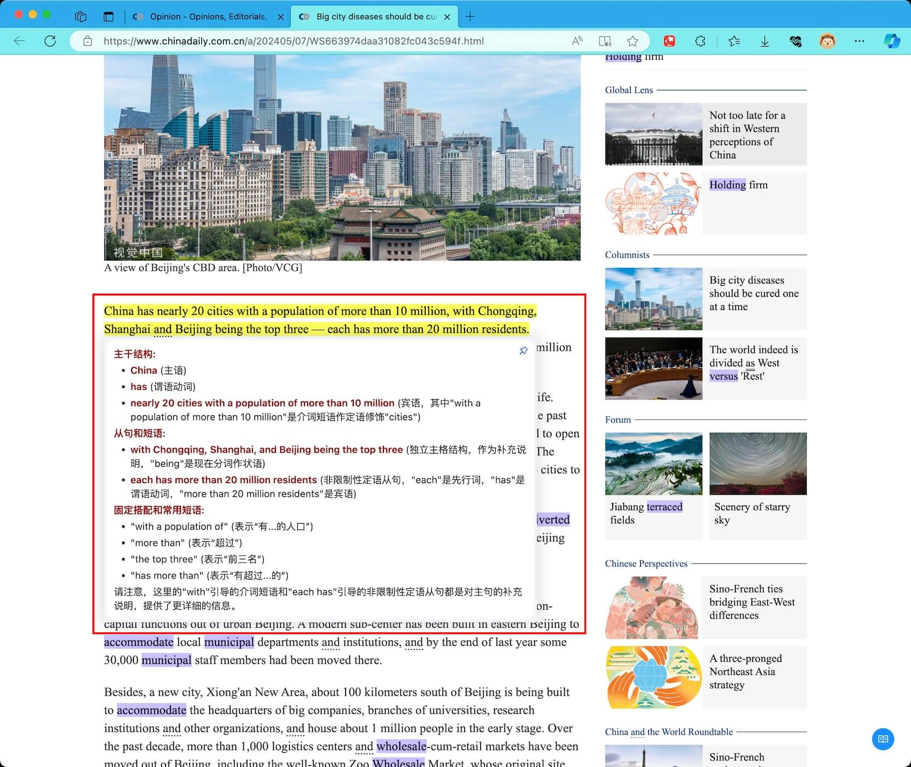
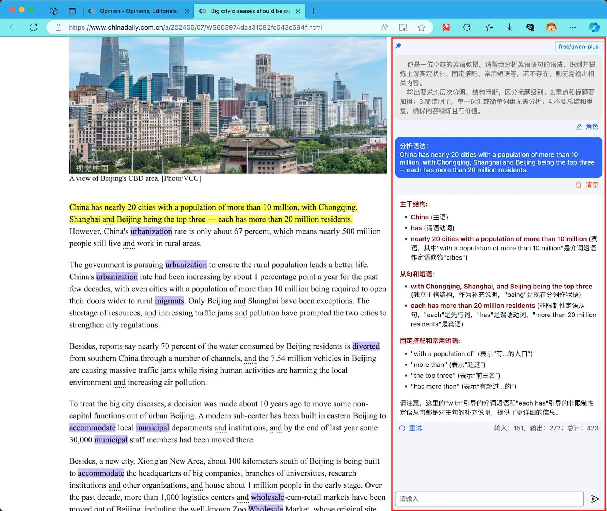
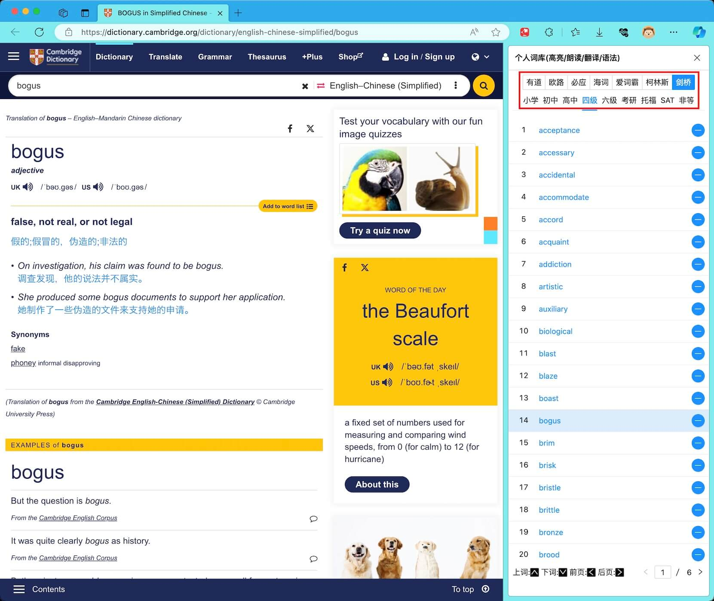
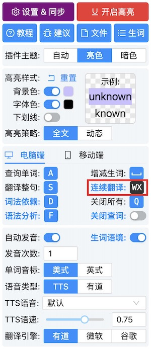
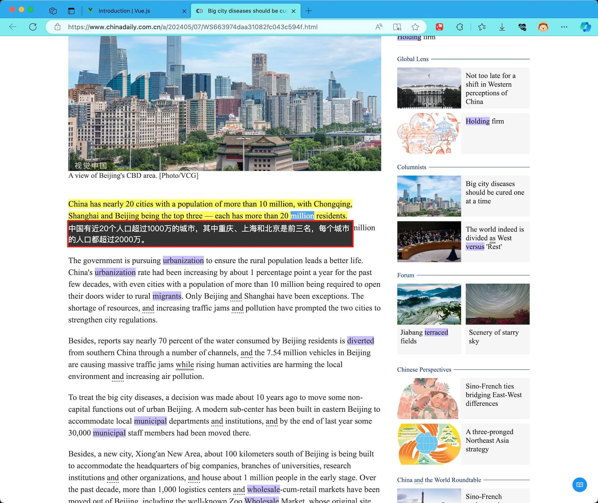

# v0.7

## 0.7.0

### AI 语法分析

- 增加**多轮对话**功能
  {data-zoomable}

- 增加**浮动**或**固定** 2 种展示，自由切换
  {data-zoomable}
  {data-zoomable}

- 增加**同步**

### 生词侧边栏

- 包括**有道、柯林斯、剑桥**等在线词典

- 词典网站**快捷键【上下左右】方向键**

  {data-zoomable}

### 翻译

- 增加**连续翻译**。存在翻译的情况下，<kbd>W</kbd> 翻译上一句，<kbd>X</kbd> 翻译下一句

  {data-zoomable}

- **翻译位置调整**：改为默认在文字底部展示翻译

  {data-zoomable}

### 其他

一些 bug 修复
