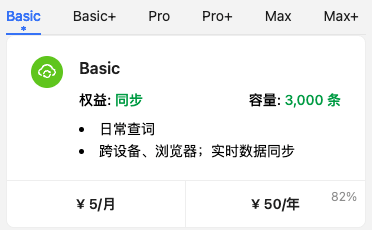
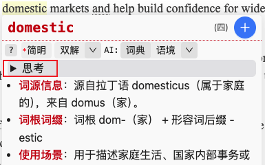

# v26.7

> ⚠️ 版本号格式更改为: X年.X月.X日

> ⚠️ 原 **gitee** 提示“**包含不适合公开的内容**”，故 **issue** (建议、bug) 迁移至 [github](https://github.com/wamich/personal-vocabulary)。

## v26.7.23

### 会员付费权益: "同步"

1. 取消插件内登录/注册，功能移至[官网](https://mingchang.wang/member/profile)
2. 增加付费“同步”权益
3. 所有注册用户已自动赠送。
   

### AI大模型

1. 增加**思考**内容展示  
   
2. 增加**额外**配置，主要用来：**禁用思考模式**，以便于**快速得到结果**  
   {data-zoomable}
3. 支持Claude **@wx:阿喜**
4. API地址更新：腾讯、商汤、阶跃；新增miniMax

### Anki 导出

1. 增加“简化版”牌组 [@10kmaggots](https://github.com/wamich/personal-vocabulary/issues/22)
2. 增加直译导出
  {data-zoomable}

### 交互

1. iPad 更好支持触控笔交互 **@wx:陈捷**
2. 根据页面运行状态更新插件图标。红色：插件在网页中运行，灰色：未运行。
3. 优化 YouTube 评论取句
